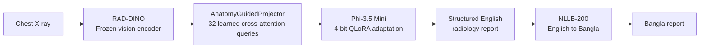
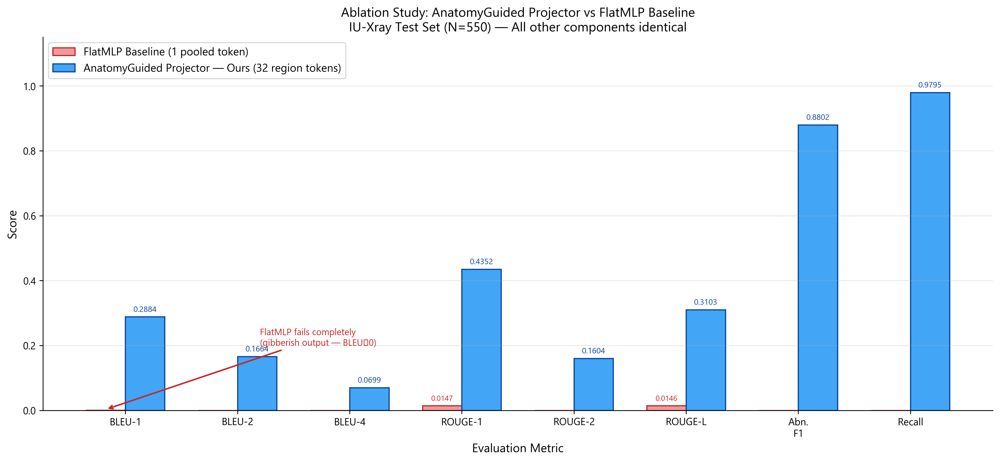

# BanglaCXR

### Low-resource chest X-ray report generation for Bangla-speaking clinical settings

BanglaCXR is a two-stage vision-language pipeline that converts a chest X-ray into a structured English radiology report and then renders that report in Bangla. The project is designed for reproducible medical AI research under constrained hardware, using a frozen radiology vision encoder, parameter-efficient language-model adaptation, and multilingual translation.

<p align="center">
  
</p>

## Why BanglaCXR?

Most chest X-ray report-generation systems produce English text. That limits practical use in Bangla-speaking hospitals and telemedicine workflows, where language accessibility is part of clinical usability. BanglaCXR explores a lightweight, reproducible route from radiological image to Bangla report without requiring a large end-to-end multimodal model.

## Pipeline



### Stage 1: English report generation

- **Vision encoder:** RAD-DINO, kept frozen during training.
- **Visual-language bridge:** `AnatomyGuidedProjector`, which maps 1,370 visual patch tokens to 32 learned region embeddings using cross-attention.
- **Language model:** Phi-3.5 Mini with 4-bit quantization and LoRA/QLoRA adaptation.
- **Training strategy:** abnormality-aware sampling, mixed precision, gradient accumulation, validation-based checkpointing, and early stopping.

### Stage 2: Bangla translation

- **Translator:** NLLB-200 distilled 600M.
- **Medical terminology:** a fixed glossary preserves important clinical terms during translation.
- **Output:** structured Bangla reports containing the generated findings and impression.

## Results

Evaluation uses 550 held-out IU X-ray studies.

### Stage 1: English report generation

| Metric | Score |
| --- | ---: |
| BLEU-1 | 0.2884 |
| BLEU-2 | 0.1664 |
| BLEU-4 | 0.0699 |
| ROUGE-1 | 0.4352 |
| ROUGE-2 | 0.1604 |
| ROUGE-L | 0.3103 |
| METEOR | 0.2820 |
| Abnormality precision | 0.7993 |
| Abnormality recall | 0.9795 |
| Abnormality F1 | 0.8802 |
| Clinical entity micro-F1 | 0.5897 |

### Stage 2: Bangla translation

| Metric | Score |
| --- | ---: |
| Bangla BLEU-1 | 0.2626 |
| Bangla BLEU-2 | 0.1358 |
| Bangla BLEU-4 | 0.0502 |
| Bangla chrF++ | 35.18 |

The Bangla scores are computed against Bangla references generated by the same NLLB translation procedure. They should therefore be interpreted as pipeline consistency and translation-quality indicators, not as a substitute for evaluation against human-authored Bangla radiology reports.

## Projector ablation

Replacing the region-level cross-attention projector with a mean-pooled single-token MLP baseline produced incoherent multilingual output and nearly zero lexical overlap:

| Metric | FlatMLP baseline | AnatomyGuidedProjector |
| --- | ---: | ---: |
| BLEU-1 | 0.0003 | 0.2884 |
| BLEU-2 | 0.0000 | 0.1664 |
| BLEU-4 | 0.0000 | 0.0699 |
| ROUGE-1 | 0.0147 | 0.4352 |
| ROUGE-L | 0.0146 | 0.3103 |
| Abnormality F1 | 0.0000 | 0.8802 |
| Abnormality recall | 0.0000 | 0.9795 |

This controlled comparison supports the central architectural finding: preserving region-level visual information is essential for grounding the decoder on this task.

<p align="center">
  
</p>

## Dataset

The experiments use the IU X-ray dataset with:

- `indiana_reports.csv` for report text
- `indiana_projections.csv` for image projections and filenames
- normalized chest X-ray images under `data/iu_xray/images_normalized/`
- a fixed train/validation/test split with 550 held-out test studies

The dataset is not included in this repository. Obtain it from its original distribution and place the files under `data/iu_xray/` before running the notebooks. Follow the dataset's original terms and citation requirements.

## Hardware and reproducibility

The manuscript experiments were designed for a single consumer laptop GPU with approximately 8.5 GB of VRAM. The notebooks use:

- Python with PyTorch and Hugging Face Transformers
- 4-bit bitsandbytes quantization
- bfloat16 autocast where supported
- gradient checkpointing
- `num_workers=0` for Windows compatibility

### Recommended execution order

1. Open `bangla_cxr_local_stage_1.ipynb`.
2. Configure the dataset and working-directory paths in the path/configuration cell.
3. Run the data preparation, RAD-DINO, projector, Phi-3.5, LoRA, dataset, and training cells.
4. Evaluate the saved `best_model_v2.pt` checkpoint and export English reports to JSON.
5. Open `bangla_cxr_local_stage_2.ipynb`.
6. Load `BanglaCXR_Local/stage2_english_reports.json` and run the NLLB translation cells.
7. Save the combined output as `stage2_bangla_reports.json`.

The baseline experiment is documented separately in `bangla_cxr_local_stage_1_baseline.ipynb` and uses the saved FlatMLP checkpoint under `BanglaCXR_Ablation/` when available locally.

## Repository layout

```text
.
|-- bangla_cxr_local_stage_1.ipynb          # Main English report-generation experiment
|-- bangla_cxr_local_stage_1_baseline.ipynb # FlatMLP ablation
|-- bangla_cxr_local_stage_2.ipynb           # Bangla translation and evaluation
|-- data/iu_xray/                            # Local dataset location, not committed
|-- diagrams/                                # Tracked thesis figures and diagrams
|-- Springer_Nature_LaTeX_Template/          # Manuscript source and bibliography
|-- BanglaCXR_Local/                         # Local checkpoints and generated outputs
|-- BanglaCXR_Ablation/                      # Local ablation outputs
|-- BanglaCXR_Stage2/                        # Local Bangla outputs
`-- README.md
```

Generated checkpoints, logs, translated JSON files, presentation exports, and temporary figures are intentionally excluded by `.gitignore`.

## Manuscript

The manuscript source is in `Springer_Nature_LaTeX_Template/`.

For the current pdfLaTeX manuscript template:

```text
pdflatex banglacxr
bibtex banglacxr
pdflatex banglacxr
pdflatex banglacxr
```

Run these commands from `Springer_Nature_LaTeX_Template/`. XeLaTeX or LuaLaTeX is recommended if Bangla text must be typeset directly rather than embedded as an image.

## Limitations

- The English training and reference reports come from IU X-ray and are not Bangla-native clinical annotations.
- Bangla evaluation currently relies on machine-translated references; human radiologist and native-speaker validation is still needed.
- The rule-based clinical labels are useful for reproducible analysis but are not equivalent to a full clinical information extraction system such as CheXbert or RadGraph.
- The ablation baseline is intentionally simple and demonstrates the importance of spatial visual grounding; broader comparisons with additional projector families would strengthen the study.
- Generated reports should be treated as research outputs, not as autonomous medical advice or a replacement for radiologist review.

## Citation

A citation entry will be added once the manuscript has a final publication or repository identifier. Until then, cite the project as an unpublished research manuscript and include the authors and title from `Springer_Nature_LaTeX_Template/banglacxr.tex`.

## License and data

This repository contains research code, notebooks, manuscript material, and derived artifacts. Dataset and pretrained-model licenses remain separate and must be respected when reproducing the experiments or redistributing outputs.
